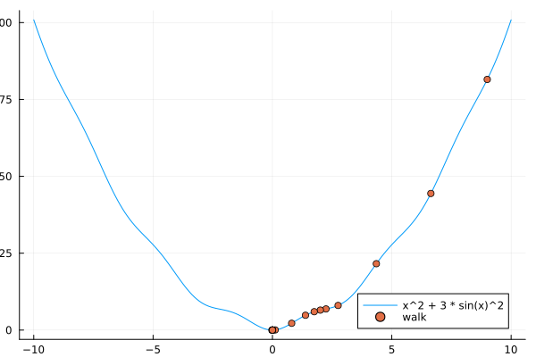

# Gradient Descent in Julia
Script that allows you to input any one dimensional function $f$ in the variable $x$ and watch the gradient descent algorithm in action.

*Example:*\
```julia gradient_descent.jl "x^2 + 3 * sin(x)^2" --steps 20 --step-size 0.15```\\
will output\

